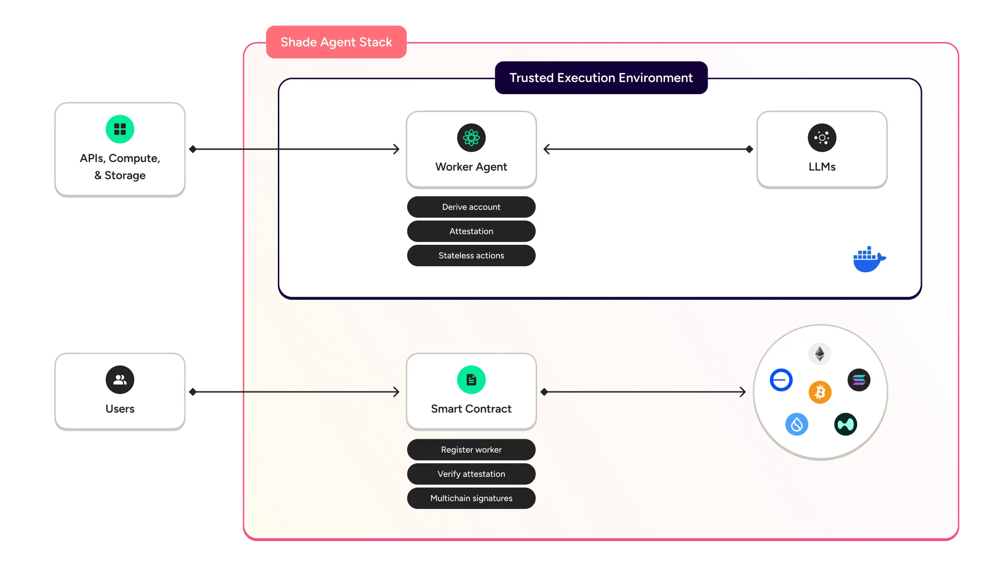
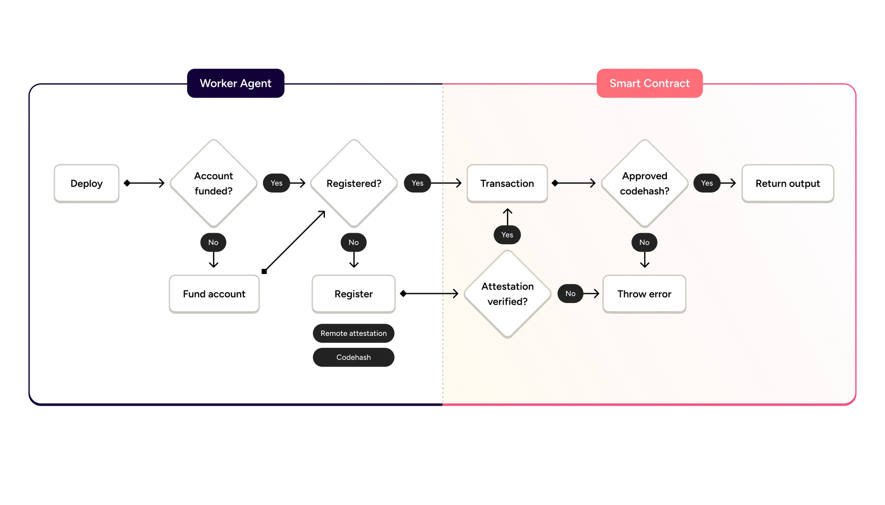

# Shade Agent Workshop Tutorial

## Introduction

Shade Agents are multichain, AI-powered smart contracts that are fully verified onchain and designed to eliminate single points of failure. They use NEAR's chain signatures for decentralized key management, and utilize "worker agents" running in Trusted Execution Environments (TEEs) to access off-chain state and make decisions utilizing the most powerful AI models.

Shade Agents can:
- Sign transactions for every chain
- Custody and trade any cryptoasset
- Access off-chain LLMs, APIs, data, computation and storage
- Enable a decentralized group of worker agents to collectively control the same key via Chain Signatures
- Preserve privacy



### Core Definitions:

- **Trusted Execution Environment (TEE)**: A secure computing environment that's completely isolated from the rest of the system (including the operating system). TEEs use hardware-based isolation to ensure that code and data inside remain protected and confidential, even from system administrators with physical access to the machine. Think of it as a "secure black box" where computations happen with cryptographic guarantees of integrity.

- **Worker Agent**: Off-chain code running in a TEE that can access external data, perform AI inference, and interact with smart contracts in a verifiable manner.

- **Remote Attestation**: The process of cryptographically verifying that specific code is running inside a genuine TEE, creating a chain of trust from hardware to application.

- **Code Hash**: A unique cryptographic fingerprint (SHA256) of the exact code running in the TEE, used to restrict access to specific contract methods.

## Core Architecture



Shade Agents consist of two primary components:

### 1. Worker Agent

A NextJS application running in a Trusted Execution Environment (TEE) that:

- Communicates with external services (like the Llama 3.3 LLM in our demo)
- Processes data in a fully isolated, secure environment
- Creates a unique NEAR account for each TEE instance
- Makes verifiable calls to the Smart Contract

### 2. Smart Contract

A NEAR contract that:

- Verifies the Worker Agent's TEE environment using remote attestation
- Validates the code hash to ensure only trusted code executes
- Controls method access based on verified code hashes
- Manages cross-chain operations via NEAR Chain Signatures

In our sentiment demo, the Worker Agent analyzes news using an LLM and generates allocation recommendations, while the Smart Contract verifies that all operations happened in a genuine TEE running trusted code.

## Demo Walkthrough: Sentiment Analysis Agent

Our demo showcases the key concepts of Shade Agents through a practical sentiment analysis application.

### Visual Demo

Here's what the demo looks like when running on your local machine:


*The main screen shows the Market Sentiment Analyzer interface with live cryptocurrency prices and market data.*


*The analysis results screen shows the sentiment analysis outcome, the TEE secure execution log, and allocation recommendations.*

The demo implementation is found in `/pages/api/sentiment.js` and `/pages/sentiment-demo.js`.

### Core Logic in the API

The API handles the sentiment analysis processing. Main workflow:

1. **Process Market News**: We collect and format news data about cryptocurrency markets.

```javascript
// From sentiment.js
// Collecting market data from request or using default data
let marketData;
if (req.method === 'POST' && req.body && Array.isArray(req.body)) {
  marketData = req.body;
} else {
  marketData = [
    { source: 'Twitter', content: 'Markets showing bullish signals as tech sector surges ahead.' },
    { source: 'Financial News', content: 'Some analysts predict a slight correction but overall positive outlook.' },
    { source: 'Market Report', content: 'Volatility increasing as investors navigate uncertainty.' }
  ];
}
```

2. **LLM Analysis**: We send this data to Llama-3.3-70B via Hyperbolic for sentiment analysis.

```javascript
async function analyzeSentiment(newsData) {
  // Format news into a structured prompt
  const newsText = newsData.map(item => `${item.source}: ${item.content}`).join('\n\n');
  
  const prompt = `
  You are a market sentiment analyzer for cryptocurrency markets. 
  Analyze the following market news and provide an overall sentiment analysis:
  
  ${newsText}
  
  Based on this news, determine:
  1. Overall sentiment (bullish, bearish, or neutral)
  2. Confidence level (0-1, where 0 is no confidence and 1 is absolute confidence)
  3. Numeric score (-10 to 10, where negative values are bearish and positive values are bullish)
  4. Detailed reasoning for your assessment
  5. Key market risks to consider
  `;

  // Call Hyperbolic with the prompt
  const response = await fetch('https://api.hyperbolic.xyz/v1/completions', {
    method: 'POST',
    headers: {
      'Content-Type': 'application/json',
      'Authorization': `Bearer ${process.env.HYPERBOLIC_API_KEY || "missing-key"}`
    },
    body: JSON.stringify({
      model: 'meta-llama/Llama-3.3-70B-Instruct',
      prompt: prompt,
      max_tokens: 800,
      temperature: 0.1
    })
  });
  
  // Process the response and extract sentiment data
  // ...
}
```

3. **Allocation Planning**: Based on the sentiment results, we generate portfolio recommendations.

```javascript
async function createAllocationPlan(sentimentResult) {
  const { sentiment, confidence } = sentimentResult;
  
  // Default balanced allocation
  let allocation = {
    BTC: 0.25,
    ETH: 0.25,
    NEAR: 0.25,
    SOL: 0.25
  };
  
  if (sentiment === 'bullish') {
    // More aggressive in bull market - weight based on confidence
    const aggressiveFactor = confidence;
    allocation = {
      BTC: 0.25 - (0.1 * aggressiveFactor),
      ETH: 0.25 + (0.1 * aggressiveFactor),
      NEAR: 0.25 + (0.05 * aggressiveFactor),
      SOL: 0.25 - (0.05 * aggressiveFactor)
    };
  } else if (sentiment === 'bearish') {
    // More conservative in bear market - weight based on confidence
    const conservativeFactor = confidence;
    allocation = {
      BTC: 0.25 + (0.15 * conservativeFactor),
      ETH: 0.25 + (0.05 * conservativeFactor),
      NEAR: 0.25 - (0.1 * conservativeFactor),
      SOL: 0.25 - (0.1 * conservativeFactor)
    };
  }
  
  // Generate transaction plan to achieve this allocation
  const transactions = generateTransactionPlan(currentAllocation, allocation);
  
  return {
    allocation,
    reasoning: `Based on ${sentiment} sentiment with ${Math.round(confidence * 100)}% confidence...`,
    transactions
  };
}
```

4. **Cross-Chain Transaction Planning**: We generate detailed transaction plans for each chain.

```javascript
function generateTransactionPlan(currentAllocation, newAllocation) {
  // Simulate portfolio worth $100,000
  const portfolioValue = 100000;
  
  // Calculate required transactions
  const transactions = [];
  
  Object.entries(newAllocation).forEach(([asset, percentage]) => {
    const currentValue = (currentAllocation[asset] || 0) * portfolioValue;
    const targetValue = percentage * portfolioValue;
    const difference = targetValue - currentValue;
    
    if (Math.abs(difference) > 100) { // Only show significant changes
      transactions.push({
        type: difference > 0 ? 'BUY' : 'SELL',
        asset,
        amountUSD: Math.abs(difference).toFixed(2),
        chain: asset === 'BTC' ? 'Bitcoin' : 
               asset === 'ETH' ? 'Ethereum' : 
               asset === 'NEAR' ? 'NEAR Protocol' : 
               asset === 'SOL' ? 'Solana' : 'Unknown',
        estimatedFee: ((Math.random() * 0.5) + 0.1).toFixed(2),
        verificationPath: `Verified by NEAR → executed on ${asset === 'BTC' ? 'Bitcoin' : 
                                                           asset === 'ETH' ? 'Ethereum' : 
                                                           asset === 'NEAR' ? 'NEAR' : 
                                                           asset === 'SOL' ? 'Solana' : 'Unknown'}`
      });
    }
  });
  
  return transactions;
}
```

5. **TEE Attestation**: For demonstration purposes, we generate simulated TEE attestation data.

```javascript
// TEE attestation details that would come from a real deployment
const teeAttestationDetails = {
  // Remote attestation details from Intel SGX
  sgxQuote: {
    mrEnclave: "d55b5fe4215c3429da52267d9c95ad3da2d9831df67a2111e869cb76e4e5db54",
    mrSigner: "83d719e77deaca1470f6baf62a4d774303c899db69020f9c70ee1dfc08c7ce9e",
    // Other attestation fields
  },
  // Phala Cloud attestation details
  phalaAttestation: {
    checksum: "phala:e5a4bd68d54d1f84",
    pruntime: "5.3.0",
    // Other Phala-specific verification data
  },
  // Docker image verification
  dockerVerification: {
    imageSha256: "sha256:92a0ad7cadcad624890ef1991c3f0d1778d2b15af3253c96bce9a06ecbeb9d2a",
    composeSha256: "sha256:3ff34927ed71d9aa13f20fffed898b2a0e95a361f5f73c950bd0c4c0efd3ab96",
    registryUrl: "docker.io/jarrodbarnes/shade-agent:latest"
  }
};
```

### Interactive UI Component

The `sentiment-demo.js` page provides an interactive UI where users can:

- Enter custom news items about the crypto market
- Run the sentiment analysis in real-time
- View the generated portfolio allocation recommendations
- See the proposed cross-chain transactions
- Verify the TEE attestation details and security logs

The UI demonstrates the full flow:
1. Off-chain data (news) is processed securely
2. AI inference happens inside the verified TEE
3. The results drive on-chain actions (portfolio rebalancing)
4. Everything is verifiable through attestation proofs

## Verification Process

In a production Shade Agent deployment, the verification process works as follows:


### 1. Remote Attestation

When running in a TEE on NEAR AI Hub, our Worker Agent generates:
- A cryptographically signed quote proving it's running in a genuine TEE
- The SHA256 hash of its Docker image (our sentiment analysis code)

The remote attestation quote contains hardware measurements that prove:
- The code is running in a genuine Intel TEE
- The memory hasn't been tampered with
- The hardware is in a secure state

### 2. On-chain Registration

The Worker Agent registers itself with the NEAR Smart Contract by calling a `register_worker` method with its attestation data. The contract:
- Verifies the attestation is from a genuine TEE using Phala's dcap-qvl library
- Confirms the Docker image hash matches the expected code
- Associates the Worker Agent's NEAR account with this verified code hash
- Records the attestation checksum for independent verification

### 3. Method Access Control

Once registered, the sentiment analysis and portfolio allocation would be authorized through the contract using code hash verification:

```rust
// Example smart contract code (not in our demo but would be used in production)
pub fn update_portfolio_allocation(&mut self, allocation: HashMap<String, f64>) {
    // Get the worker agent that's calling this method
    let worker = self.get_worker(env::predecessor_account_id());
    
    // Ensure it's our verified sentiment analysis code
    require!(
        SENTIMENT_ANALYZER_HASH == worker.codehash,
        "Only the verified sentiment analyzer can update allocations"
    );
    
    // Update the allocation and prepare cross-chain transactions
    self.update_allocation(allocation);
}
```

This ensures that only our verified sentiment analysis code running in a TEE can update portfolio allocations - providing a high level of security.

In our demo, we simulate these verification steps in the security log that shows the full attestation process.

## Real-World Applications

Our sentiment analysis demo illustrates the fundamental principles that can power various applications:

### 1. Mindshare Index Fund

Like our demo, but scaled up to:
- Track sentiment across all social media, news sources, and on-chain data
- Automatically rebalance a portfolio across multiple chains based on real-time mindshare metrics
- Provide transparent, verifiable reasoning for all investment decisions

### 2. Decentralized Solvers

Create optimizers that:
- Accept asset deposits on any chain
- Use off-chain data and AI to fulfill user intents at the best rates
- Automatically rebalance across DEXs, bridges, and liquidity pools
- Provide cryptographic proof that they're executing optimally

### 3. Prediction Markets

Build markets where:
- Resolution is handled by verified Worker Agents that access off-chain data sources
- LLMs can interpret complex resolution criteria
- No challenge periods are needed because the resolution is verifiably fair
- Results are available immediately with cryptographic proof

### 4. Lending Optimizers

Create lending platforms that:
- Instantly match borrowers with lenders at optimal rates
- Analyze real-time conditions across DeFi protocols
- Automatically move funds to maximize yield
- Provide verifiable proof that the optimization is working as intended

The common thread across all these applications is that Shade Agents enable:
- Verifiable off-chain computation
- Multi-chain interactions
- Autonomous decision-making
- Privacy preservation

## Practical Deployment Steps

If you want to build your own Shade Agent like our sentiment analyzer, follow these steps:

### 1. Local Development

Start by cloning the template and setting up your local environment:

```bash
git clone https://github.com/NearDeFi/shade-agent-template
cd shade-agent-template
yarn
yarn dev
```

This gives you a local NextJS environment for building your Worker Agent.

You can view the example app at `http://localhost:3000` and access the sentiment demo at `http://localhost:3000/sentiment-demo`.

### 2. NEAR Smart Contract Setup

For development, you'll need to:

1. Install Rust and cargo-near
2. Build and deploy the contract:
   ```bash
   cd contract
   cargo near build
   cargo near deploy --accountId your-testnet-account.testnet
   ```

3. Configure your environment:
   Create a `.env.development.local` file with:
   ```
   NEXT_PUBLIC_contractId=your-contract.your-testnet-account.testnet
   NEXT_PUBLIC_accountId=your-testnet-account.testnet
   NEXT_PUBLIC_secretKey=your-private-key
   ```

### 3. Docker Image Creation

Package your Worker Agent as a Docker image for TEE deployment:

```bash
# Update package.json with your Docker Hub details first
yarn docker:build
yarn docker:push
```

Make note of the SHA256 hash output - this uniquely identifies your Worker Agent code.

### 4. Phala Cloud Deployment

To deploy to a real TEE environment:

1. Update your `docker-compose.yaml` with your Docker image details and SHA256 hash
2. Go to Phala Cloud
3. Click Deploy → From Sketch → Advanced
4. Paste your YAML configuration
5. Name your instance and deploy

Once deployed, you'll get a public URL for your Worker Agent, where you can access your UI and API endpoints.

### 5. Registration and Verification

The final step is registration:

1. Access the `/api/register` endpoint on your deployed Worker Agent
2. It will generate attestation data and call the contract's `register_worker` method
3. Once registered, your Worker Agent can access protected methods

## Conclusion

In this tutorial, we've explored how our sentiment analysis demo embodies the core principles of Shade Agents:

- Worker Agents running in TEEs that can access AI models and external data
- Smart Contracts that verify the TEE environment and code hash
- Method access control tied to verified code rather than accounts
- Cross-chain transactions driven by AI intelligence

This powerful combination enables:
- Verifiable access to off-chain resources like LLMs
- Cross-chain operations without compromising security
- Transparent yet private decision-making

To explore further:
1. Experiment with our sentiment demo
2. Modify the LLM prompts to explore different analysis approaches
3. Try implementing your own Shade Agent use case

## Additional Resources

- GitHub Repository: [github.com/NearDeFi/shade-agent-template](https://github.com/NearDeFi/shade-agent-template)
- NEAR Chain Signatures: [docs.near.org/concepts/abstraction/chain-signatures](https://docs.near.org/concepts/abstraction/chain-signatures)
- NEAR Intents: [docs.near.org/chain-abstraction/intents/overview](https://docs.near.org/chain-abstraction/intents/overview)
- Phala Cloud: [phala.network](https://phala.network)
